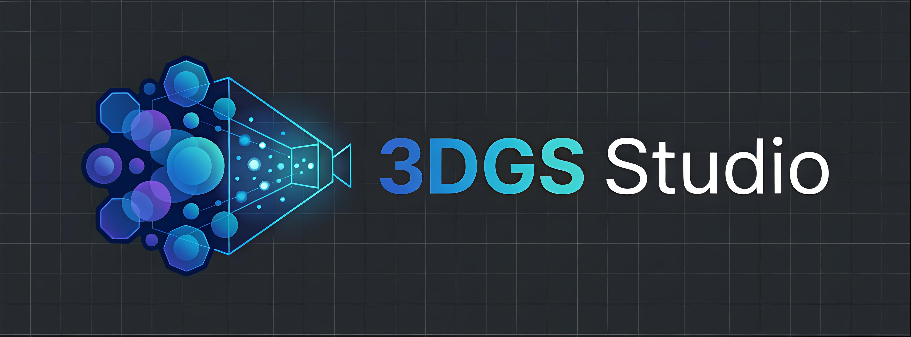

<p align="center">
  
</p>

<h1 align="center">3DGS Studio</h1>

<p align="center">
  Browser workstation for 3D Gaussian Splatting.
</p>

<p align="center">
  Load local scenes, clean noisy splats, plan pivot-based camera motion, and export MP4 previews without leaving the browser.
</p>

<p align="center">
  English | <a href="./README.zh-CN.md">简体中文</a>
</p>

<p align="center">
  <a href="./docs/guide.md">User Guide</a> ·
  <a href="./docs/guide.zh-CN.md">中文指南</a> ·
  <a href="#quick-start">Quick Start</a> ·
  <a href="#roadmap">Roadmap</a>
</p>

<p align="center">
  <a href="./LICENSE"></a>
  <a href="https://github.com/sparkjsdev/spark"></a>
</p>

`3DGS Studio` turns the browser into a lightweight 3DGS presentation workstation. Instead of stopping at scene inspection, it covers the full loop: load a local model, remove stray splats, block out a camera path around a pivot, preview the motion, and export the result as MP4.

## Why It Feels Different

| Workflow | What You Get |
| --- | --- |
| Local-first loading | Drag in `.ply`, `.splat`, `.spz`, or `.ksplat` files directly, with no backend setup |
| Pivot-based planning | Double-click to set a stable focal center, then build camera motion around it |
| Cleanup inside the viewer | Remove noisy splats with `Picker` and `Brush`, plus undo and redo support |
| Export-ready output | Reuse the same planned path for both live preview and MP4 export |

## Interface Preview

> Current preview assets still show the Chinese UI and are intentionally kept with a `-zh-CN` suffix until the English screenshots are replaced.


## Demo


## Feature Highlights

| Area | Highlights |
| --- | --- |
| Shot Planning | Pivot-based camera focus, discrete shot points, path preview, MP4 export |
| Splat Editing | `Picker`, `Brush`, multi-step undo/redo, visible-splat `.ply` save |
| Viewer Workflow | Local uploads, drag and drop, world-up alignment, keyboard-friendly controls |
| Presentation Loop | Load, clean, plan, preview, and export in one place |

## Quick Start

### 1. Requirements

- Use a modern browser with `WebCodecs` support, such as Chrome or Edge
- Serve the project over HTTP instead of opening `index.html` directly

### 2. Start a Local Server

```bash
python -m http.server 8080
```

Then open `http://localhost:8080`.

### 3. First 60 Seconds

1. Click `Open File`, or drag a local 3DGS model into the page.
2. Double-click the subject you want to focus on to set the `Pivot`.
3. Enter planner mode and press `+` to add shot points from the current camera view.
4. Press `P` to preview the path and refine the motion.
5. Press `E` to enter edit mode and clean noisy splats with `Picker` or `Brush`.
6. Export the result from the upper-right panel as an MP4 preview.

## Controls at a Glance

| Task | Input |
| --- | --- |
| Load a model | `Open File` or drag and drop |
| Set pivot | Double-click scene |
| Enter planner | Planner toggle |
| Add shot point | `+` |
| Preview path | `P` |
| Enter editing | `E` |
| Picker / Brush | `1` / `2` |
| Delete selection | `Del` |
| Undo / Redo | `Ctrl+Z` / `Ctrl+Y` |
| Save visible splats | `Ctrl+S` |

## Documentation

- English guide: [docs/guide.md](./docs/guide.md)
- 中文指南: [docs/guide.zh-CN.md](./docs/guide.zh-CN.md)

## Roadmap

- [ ] Load remote model files by URL for lightweight scene sharing
- [ ] Compare multiple scenes for before / after review
- [ ] Introduce a modern build setup such as Vite and split `viewer.js` into modules
- [ ] Add stronger editing tools such as bounding-box deletion and ROI extraction

## Acknowledgements

- [Spark.js](https://github.com/sparkjsdev/spark) by World Labs
- [Three.js](https://github.com/mrdoob/three.js)
- [mp4-muxer](https://github.com/Vanilagy/mp4-muxer)

## License

This project is released under the [MIT License](./LICENSE).
