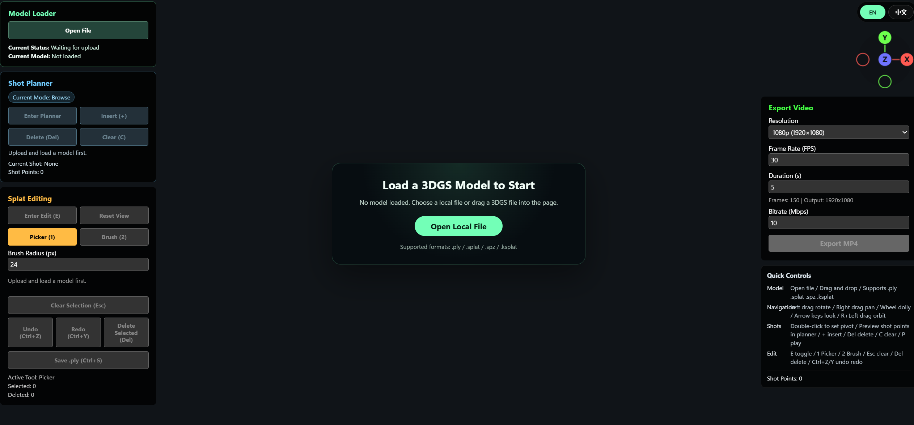

<p align="center">
  
</p>

<h1 align="center">3DGS Studio</h1>

> 🎨 **不仅仅是查看器：在浏览器中直接展示、清理、规划并导出 3D Gaussian Splatting 场景**

[](./LICENSE)
[](https://github.com/sparkjsdev/spark)

`3DGS Studio` 是一个纯浏览器端的 3D Gaussian Splatting (3DGS) 轻量工作台。相比于传统的单机查看工具，它专注于**场景展示**与**二次创作**流程，让你能够极其方便地在网页中载入模型、剔除噪点、规划相机运镜，并直接导出 MP4 演示视频。

无需复杂的后端配置，一行命令启动，即刻拥有本地 3DGS 工作流。

## 📸 界面预览



---

## 🎥 动态演示


---

## 🌟 核心特性

- 🎬 **专业的镜头规划与视频导出**
  - **基于 Pivot 的聚焦系统**：双击设置场景中心，从此告别混乱的旋转和走位
  - **离散镜头点插值**：告别繁琐的“手动拖拽录制”，像做幻灯片一样设置关键机位
  - **所见即所得导出**：预览与 MP4 视频导出完全复用同一套相机路径和渲染逻辑
  
- 🧹 **纯前端的 Splat 轻编辑**
  - 提供 `Picker` (点选) 与 `Brush` (刷选) 两种灵活的删噪模式
  - 支持多步骤的撤销 / 重做 (Undo / Redo) 机制
  - 一键将清理后的可见 Splats 导出为干净的 `.ply` 文件
  
- ⚡ **无缝的浏览体验**
  - 纯前端解析与渲染，你的隐私数据不离本地计算机
  - 即插即用，支持直接拖拽 `.ply`, `.splat`, `.spz`, `.ksplat` 格式文件
  - 自动将上传模型的场景主平面对齐至世界坐标系

---

## 🚀 快速开始

### 1. 环境准备

- 推荐使用支持 `WebCodecs` 的现代浏览器（如 Chrome / Edge）
- 项目需要通过 HTTP 服务启动，请勿直接双击打开 HTML

### 2. 启动服务

进入项目目录后，通过终端执行：

```bash
# 使用 Python 快速启动本地 HTTP 服务
python -m http.server 8080
```

打开浏览器访问 `http://localhost:8080` 即可开始使用。

### 3. 一分钟上手

1. **载入场景**：拖拽任意受支持的 3DGS 文件到窗口中。
2. **设定焦点**：找到你最想展示的主体，**双击**它以设置 `Pivot`（旋转中心）。
3. **规划运镜**：点击“进入规划”，在合适的角度按下 `+` 添加镜头点，按 `P` 预览丝滑运镜。
4. **清理瑕疵**：按下 `E` 唤出画笔，轻松刷掉边缘的悬浮噪点。
5. **产出成果**：在右上角面板设置分辨率和帧率，一键导出高质量的 MP4 视频！

---

## 📖 详细文档

欲了解全部快捷键操作、详细的镜头插值原理或删除编辑的高阶用法，请参阅：

👉 **[完整使用指南 (User Guide)](./docs/guide.md)**

---

## 🗺️ 演进路线 (Roadmap)

当前项目已完成最核心的“载入 -> 清理 -> 运镜 -> 导出”闭环。为打造更强大的 3DGS 开源平台，我们接下来的方向：

- [ ] **场景共享**：支持通过 URL 载入远程模型文件，实现项目的快速在线分享
- [ ] **对比审阅**：支持加载多个模型并进行 Before / After 的效果对比
- [ ] **工程化改造**：引入 Vite 等现代构建工具，拆解 `viewer.js` 的耦合代码
- [ ] **增强编辑**：支持 3D 裁切盒 (Bounding Box) 批量剔除与局部 ROI 提取

---

## 🤝 致谢

本项目的渲染与部分核心交互基于以下优秀的开源工作构建，特此致谢：

- [Spark.js](https://github.com/sparkjsdev/spark) (by World Labs)
- [Three.js](https://github.com/mrdoob/three.js)
- [mp4-muxer](https://github.com/Vanilagy/mp4-muxer)

## 📄 许可证

本项目采用 [MIT License](./LICENSE) 开源。欢迎任何人参与贡献，提交 PR 或反馈 Issue。
