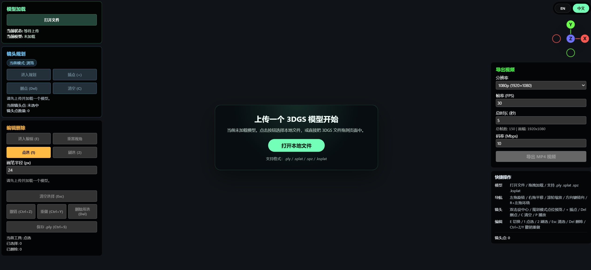

<p align="center">
  
</p>

<h1 align="center">3DGS Studio</h1>

<p align="center">
  面向 3D Gaussian Splatting 的浏览器工作台：在浏览器中直接完成本地场景载入、噪点清理、Pivot 运镜规划与 MP4 导出。
</p>

<p align="center">
  <a href="./README.md">English</a> | 简体中文
</p>

<p align="center">
  <a href="./docs/guide.md">User Guide</a> ·
  <a href="./docs/guide.zh-CN.md">中文指南</a> ·
  <a href="#快速开始">快速开始</a> ·
  <a href="#演进路线">演进路线</a>
</p>

<p align="center">
  <a href="./LICENSE"></a>
  <a href="https://github.com/sparkjsdev/spark"></a>
</p>

`3DGS Studio` 把浏览器变成一个轻量的 3DGS 展示工作台。它不只负责“看模型”，而是覆盖完整的展示闭环：载入本地场景、去掉漂浮 splats、围绕 Pivot 规划相机路径、实时预览，并最终导出 MP4 演示视频。

## 为什么它不只是查看器

| 工作流 | 你能得到什么 |
| --- | --- |
| 本地优先载入 | 直接拖入 `.ply`、`.splat`、`.spz`、`.ksplat` 文件，无需后端配置 |
| 基于 Pivot 的运镜 | 双击设定稳定焦点，再围绕中心组织镜头路径 |
| 浏览器内轻编辑 | 手动清理噪点，或先预览自动识别的漂浮 splats 候选再应用 |
| 直接导出结果 | 预览和 MP4 导出复用同一条运镜路径，减少来回对齐 |

## 界面预览



## 工作流预览


## 功能亮点

| 模块 | 亮点 |
| --- | --- |
| 镜头规划 | 基于 Pivot 聚焦、离散镜头点、路径预览、MP4 导出 |
| Splat 编辑 | `Picker`、`Brush`、漂浮球候选自动分析、多步撤销 / 重做、可见 splats `.ply` 保存 |
| 查看器体验 | 本地上传、拖拽载入、世界坐标对齐、键盘友好操作 |
| 展示闭环 | 在同一个页面里完成载入、清理、规划、预览与导出 |

## 快速开始

### 1. 环境准备

- 推荐使用支持 `WebCodecs` 的现代浏览器，例如 Chrome / Edge
- 项目需要通过 HTTP 服务启动，请勿直接双击打开 `index.html`

### 2. 启动服务

```bash
python -m http.server 8080
```

然后访问 `http://localhost:8080`。

### 3. 前 60 秒怎么上手

1. 点击 `Open File`，或直接把本地 3DGS 文件拖到页面中。
2. 双击你想聚焦的主体，设置 `Pivot` 作为镜头中心。
3. 进入规划模式后按 `+`，从当前机位插入镜头点。
4. 按 `P` 预览整条路径，微调运镜效果。
5. 按 `E` 进入编辑模式，用 `Picker`、`Brush` 或 `分析漂浮球` 清理噪点。
6. 在右上角面板导出最终 MP4 预览视频。

## 常用操作速览

| 任务 | 操作 |
| --- | --- |
| 载入模型 | `Open File` 或拖拽上传 |
| 设定 Pivot | 双击场景 |
| 进入规划 | Planner 切换按钮 |
| 添加镜头点 | `+` |
| 预览路径 | `P` |
| 进入编辑 | `E` |
| 点选 / 刷选 | `1` / `2` |
| 删除所选 | `Del` |
| 撤销 / 重做 | `Ctrl+Z` / `Ctrl+Y` |
| 保存可见 splats | `Ctrl+S` |

## 详细文档

- English guide: [docs/guide.md](./docs/guide.md)
- 中文指南: [docs/guide.zh-CN.md](./docs/guide.zh-CN.md)

## 演进路线

- [x] 增加悬浮 splats 自动过滤功能，减少手动清理成本
- [ ] 增加预设运镜曲线与最优轨迹生成功能，加快镜头规划流程
- [ ] 增加单个相机视角位置微调功能，便于精确调整每个机位

## 致谢

- [Spark.js](https://github.com/sparkjsdev/spark) (by World Labs)
- [Three.js](https://github.com/mrdoob/three.js)
- [mp4-muxer](https://github.com/Vanilagy/mp4-muxer)

## 许可证

本项目采用 [MIT License](./LICENSE) 开源。
